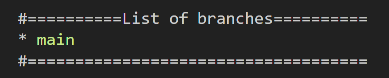
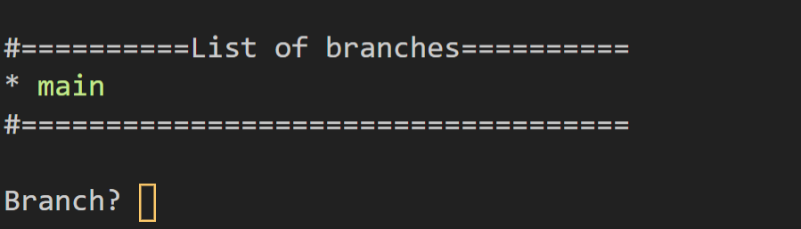
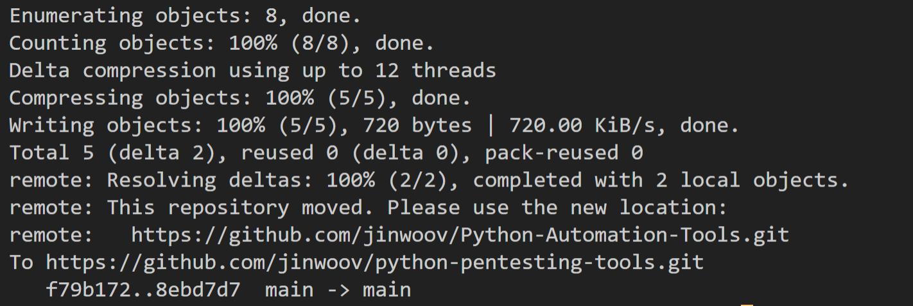

# Github Automation Tool

This tool is designed to automate the Gitflow process. Tedious `git add to git push` can be automated and simple execution of this python file will do the repetitive work for you.

*Edited on: 12/22/2020*  

## How to use this tool

1. Make sure that python file is executed from root of the repository.
```md
*root* <--------HERE
   \---folder
    \--- folder1
     \--- folder2
```
2. After executing it will prompt for commit message.  

3. After typing your commit message it will prompt you with list of remote/local branches attach to this repository.  

4. It will then ask for branch that you want to commit from.  

5. Upon entering the branch name it will push to the repository.  

